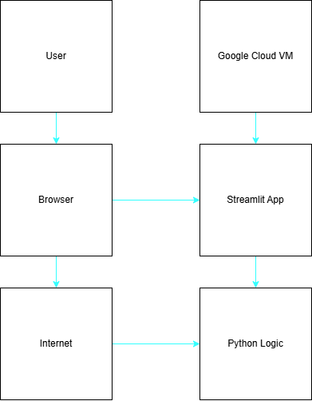

# Gym Menu Generator

## Overview

筋トレのメニューを自動生成するWebアプリです。  
BIG3（ベンチプレス・スクワット・デッドリフト）の重量を入力すると、推定1RMを計算し、Push / Pull / Legs のトレーニングメニューを生成します。

PythonとStreamlitを用いてWebアプリを開発し、Google Cloud Compute Engine上のVMで公開しています。

## Features

・BIG3重量入力  
・推定1RM計算  
・トレーニングメニュー自動生成  

## Tech Stack

Python  
Streamlit  
pandas  
Google Cloud (Compute Engine)  

## Architecture

## Run Locally

streamlit run menu_app.py

## Live Demo

http://34.121.9.30:8501
